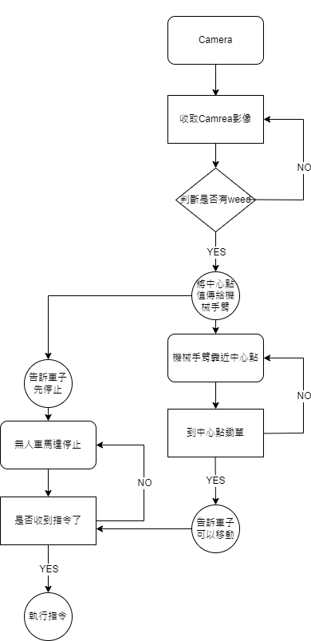

# 2022-06-15 進度回報

1. 由於先前想使用紅色mask去抓取手臂，但效果不理想，因此決定使用yolov5去分別判斷機械手臂，以及雜草，用此方式取得相對應位置
   
2. 錄製機械手臂移動影片，並且訓練yolov5，得到 arm_best.pt

3. 將機械手臂末端的馬達換掉後，會無法識別，因此目前最後一個馬達未連通

4. 由於判斷出來的機械手臂以及雜草位置會有視差，因此要計算兩點最短距離，並且紀錄上一次的距離，如果比較過後，上一次的距離比較短，則移回上一個步驟。

5. 機械手臂的移動優先順序，先上下，再左右。

 

